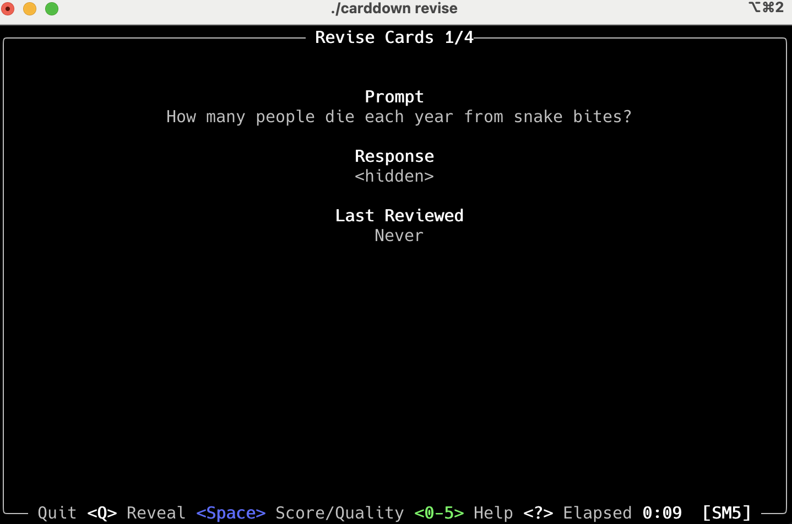

# CARDDOWN

CARDDOWN is a simple cli tool to keep track of (and study) flashcards in text files.



## Features

  - Scans your notes-files for flashcards with facts that you want to remember.
  - Keeps tracks of flashcards by hash of its contents, thus supports files being edited and cards moved around.
  - Extracted cards and meta-data are stored in a separate folder, the original files are never not modified.
  - Supports tags, enabling specific study sessions.
  - Supports multiple [spaced-repetition](https://en.wikipedia.org/wiki/Spaced_repetition) algorithms.
  - No dependencies, fast, human-readable non-binary formats.

## Installation

```
cargo install carddown
```

## Usage

CARDDOWN has 3 commands:

- scan: Scan files and folders for new and or updated flashcards.
- audit: Show statistics about your flashcards, prune orphan a leech cards.
- revise: Study your flashcards.

Audit and Revise mode use a terminal UI, with help prompts to describe key bindings.

### Revise
When you launch a revise session, you will be presented with all flashcards that a due to be revised.

The main flow for each card is as follows:

1. Try to remember the hidden response to the prompt (or remember the prompt given the response if reversed probability is set).

2. Press the space-key to reveal the correct response.

3. Grade the quality of your recall from 0 to 5;

| Quality                      | Grade |
|------------------------------|-------|
| Perfect                      | 5     |
| Correct With Hesitation      | 4     |
| Correct With Difficulty      | 3     |
| Incorrect But Easy To Recall | 2     |
| Incorrect But  Remembered    | 1     |
| Incorrect And Forgotten      | 0     |

Qualities of 0, 1 and 2 considered a failure and will reset the card to the beginning of the learning queue.

The following flags are used to configure the revise session:

```
Usage: carddown revise [OPTIONS]

Options:
      --maximum-cards-per-session <MAXIMUM_CARDS_PER_SESSION>
          [default: 30]
      --maximum-duration-of-session <MAXIMUM_DURATION_OF_SESSION>
          in minutes [default: 20]
      --leech-failure-threshold <LEECH_FAILURE_THRESHOLD>
          Threshold before a item is defined as a leech [default: 15]
      --leech-method <LEECH_METHOD>
          [default: skip] [possible values: skip, warn]
      --algorithm <ALGORITHM>
          [default: sm5] [possible values: sm2, sm5, simple8]
      --tag <TAG>
          Tags to filter cards, no tags matches all cards
      --include-orphans
          include orphaned cards
      --reverse-probability <REVERSE_PROBABILITY>
          Likelihood that prompt and response are swapped. 0 = never, 1 = always [default: 0]
      --cram
          Cram session. Revise all cards regardless of interval if they haven't been revised in the last 12 hours. Does not effect spaced repetition stats of the cards
```

### Scan
You can scan your source files as many time as you want. CARDDOWN will keep track of the cards you have already scanned and update them if you moved them around. A card will keep all its meta-date as long as the prompt/response or tags haven't changed.

```
Arguments:
  <PATH>  Path to file or folder to scan

Options:
      --file-types <FILE_TYPES>  File types to parse [default: md txt org]
      --full                     Full scan (default incremental), can generate orphansUsage: carddown scan [OPTIONS]
```

If `--full` flag is not set (default), CARDDOWN will do an incremental scan which will not generate orphan cards.

### Audit
In audit-mode you can review your orphan an leech cards. Orphan cards can be removed from the CARDDOWN database in the audit view, but leeches has to be fixed in the source files.

## Writing flashcards
CARDDOWN supports single and multi-line flashcards. These flashcards can be anywhere in your markdown/text files.

A single-line flashcards has this form:

```markdown

PROMPT : RESPONSE 🧠 #tag1 #tag2
PROMPT : RESPONSE #flashcard #tag1 #tag2

Who was the first president of the USA? : George Washington 🧠
```

Note that you can use "🧠" or "#flashcard" interchangeably to mark a flashcard.


A multi-line flashcard has this form:

```markdown

PROMPT #flashcard #tag1 #tag2
RESPONSE LINE 1
RESPONSE LINE 2
- - -
```

The following markers are valid to terminate a multi-line flashcard:

```markdown
- - -
---
* * *
***
```

See [test.md](tests/test.md) for an example of how to write flashcards.

## Terminology

  - *Leech*
    A card that you have failed to remember multiple times. A Leech cards slows your learning progress
    and should be pruned from your deck, spit into multiple cards or written in a different way.
  - *Orphan*
    A card that doesn't exists in its current form in the source files. This can happen if you
    change or delete a card in the source file. Orphan cards can be pruned by the audit command.

## Rationale

- I have a lot of notes in markdown, some of them contains facts that I want to be able to recall easily.
- I want to use a cli tool for drilling these facts that is simple and easy to use and install.
- I want to easily mark facts in my notes (turn them into flashcards).
- I want a single markdown file to contain an arbitrary number of flashcards.
- I edit my notes often, and move stuff around within and between files.
- I want to the tool to keep track of the cards I want to practice, even when they move.
- I want to be able to constrain what to practice via tags.
- I want to the tool to keep track of my progress and adjust the practice schedule accordingly.
- I want to explore different spaced repetition algorithms.

## Acknowledgements

- [NeuraCache Markdown Flashcard Specification](https://github.com/NeuraCache/markdown-flashcards-spaced-repetition)
- [Emacs org-drill mode](https://gitlab.com/phillord/org-drill/)
